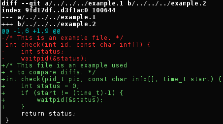
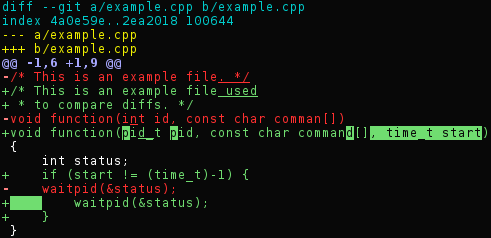
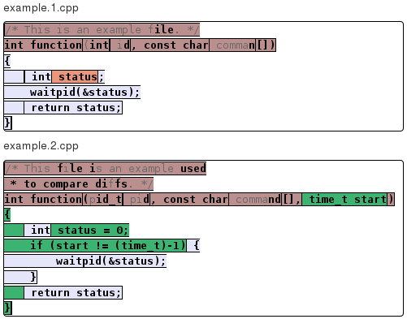

**[zograscope][zograscope] :: zs-diff**


1. [Description](#description)
2. [Comparison](#comparison)
3. [Running without integration](#running-without-integration)
4. [Integrating into Git](#integrating-into-git)

## Description ##

`zs-diff` is a terminal-based syntax-aware diff.  The syntax-aware part means
that comparison isn't sensible to formatting changes and understands general
structure of its input.

The primary purpose of the utility is to be used as external diff within `git`.

### Status ###

Complicated changes of expressions or rewrites of functions might produce
results that are hard to understand.  Small or medium changes should be mostly
handled well.

## Comparison ##

This section presents various kinds of alternative diffs and demonstrates why
syntax-aware ones are useful.

The example was crafted to be small, non-trivial (all tools handle trivial
changes gracefully) and demonstrate all four kinds of changes (deletion,
insertion, update and move).  It partially avoids cases which due to current
heuristics don't look that nice in `zs-diff`, but is otherwise objective (those
cases are usually less common and aren't actually handled well by other tools
either).

#### `git-diff` ####



Complete removal and addition isn't bad on its own, but it forces to match lines
manually and look for changes in them manually too
([diff-highlight][diff-highlight] script doesn't work in cases like this one).

#### `diff --side-by-side` ####


Somewhat more readable version of `git-diff` even though it lacks highlighting.

#### [cdiff][cdiff] ####



The alignment is good.  Highlighting within lines is somewhat messy.

#### [icdiff][icdiff] ####


This is quite readable actually, but again character-level diffing is hard to
understand.

#### [ydiff][ydiff] ####


The granularity of detected changes is coarse, but changes can be identified.

#### [gumtree][gumtree] ####



Disregarding unfortunate colors it's possible to see that structural changes
were in fact captured albeit not perfectly.

#### zs-diff ####


Alignment and fine-grained matching need improvements as well as change
detection for more complicated cases in general, but changes that were applied
to this piece of code are quite easy to see and reason about.

## Running without integration ##

### Outside git repository ###

Just do:

```bash
zs-diff old-file new-file
```

### Inside git repository ###

Interactive (say `y` to view specific file):

```bash
git difftool -x zs-diff
```

Non-interactive (there might be errors printed for files that are failed to
parse, which is fine):

```bash
GIT_EXTERNAL_DIFF='zs-diff --color' git show --ext-diff
```

## Integrating into Git ##

Add `zs-diff` as a diff tool to `git` with these lines (`.git/config`):

```config
[diff "zs-diff"]
    command = zs-diff --color
```

Then configure which files it should be used for (`.git/info/attributes`):

```gitattributes
*.[ch]        diff=zs-diff
*.h.in        diff=zs-diff

*.[ch]pp      diff=zs-diff

Makefile      diff=zs-diff
Makefile.am   diff=zs-diff
Makefile.win  diff=zs-diff
```

This will make it work for `git diff`, but `git show`, `git log` or other
subcommands don't use custom diff tools by default and require `--ext-diff`
option to be specified and might require use of an alias.

If parsing or comparison failed for some reason, `git diff --no-ext` will be
called to produce diff so in the worst case a regular diff will be displayed.

[zograscope]: ../../README.md

[diff-highlight]: https://github.com/git/git/tree/master/contrib/diff-highlight
[cdiff]: https://github.com/ymattw/cdiff
[icdiff]: https://www.jefftk.com/icdiff
[ydiff]: https://github.com/yinwang1/ydiff
[gumtree]: https://github.com/GumTreeDiff/gumtree
